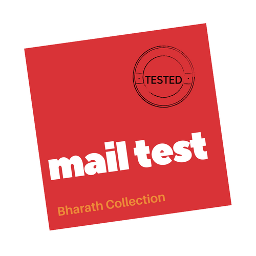

<h1 align="center">
	<br>
	
	<br>
</h1>

[](https://github.com/bharathvaj1995)

## mail-test

Cli tool to validate email making use of powerful [Mail Test](http://mailtest.in) API.

## Installation

```
$ npm install -g mail-test-cli
```

## Features

* Cache Enabled
* Promise Based
* Colourful CLI

## Usage

<h1 align="center">
	<br>
	
	<br>
</h1>

```
    $ mail-test --help
    Usage
	  $ mail-test <email address>
	Example
	  $ mail-test bharathvaj@zoho.com
	  This domain is active and is set up to receive emails normally.
```

## License

MIT © [Bharathvaj Ganesan](https://github.com/bharathvaj1995)
